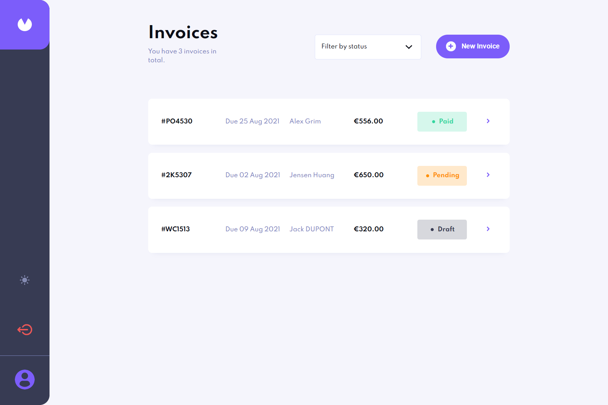
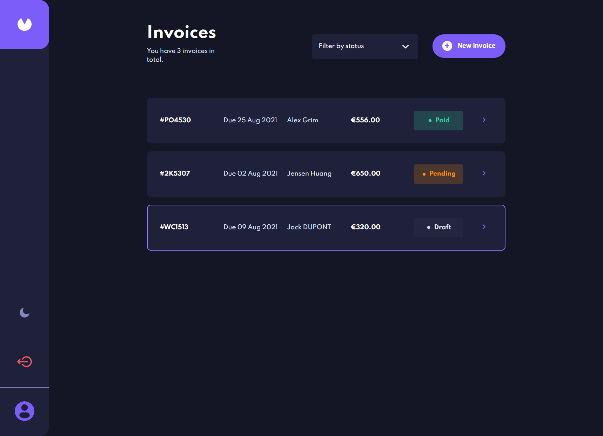

# Frontend Mentor - Invoice app solution

This is a solution to the [Invoice app challenge on Frontend Mentor](https://www.frontendmentor.io/challenges/invoice-app-i7KaLTQjl). Frontend Mentor challenges help you improve your coding skills by building realistic projects. 

## Overview

### The challenge

Users should be able to:

- View the optimal layout for the app depending on their device's screen size
- See hover states for all interactive elements on the page
- Create, read, update, and delete invoices
- Receive form validations when trying to create/edit an invoice
- Save draft invoices, and mark pending invoices as paid
- Filter invoices by status (draft/pending/paid)
- Toggle light and dark mode
- **Bonus**: Keep track of any changes, even after refreshing the browser (`localStorage` could be used for this if you're not building out a full-stack app)

### Screenshot

  Light Mode

  Dark Mode

### Links

- [Solution URL](https://invoice-app-moussa.vercel.app/)

### Built with

- HTML/CSS 
- SASS - For styles
- [React](https://reactjs.org/) - Javascript Library
- [Next.js](https://nextjs.org/) - React Framework 
- [Strapi](https://strapi.io/) - Headless CMS 
- [Formik](https://formik.org/) - React Form library 
- [Yup](https://github.com/jquense/yup/) - JavaScript schema builder 
- [Axios](https://axios-http.com/) - HTTP client for the browser and node.js 

### What I learned

This is the first project I built with Next.js and Strapi. 
- Next.js
...The front-end is done with Next.js
...I use the server side rendering for all the pages and the 404 page is static server rendering

- Strapi
...The back-end is done with Strapi.
...I use the default REST API to create my API

## Author

- Website - [Moussa Mamadou](http://www.moussamamadou.com)
- Frontend Mentor - [@moussamamadou](https://www.frontendmentor.io/profile/moussamamadou)

